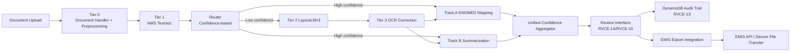

# Architecture Overview

## High-level architecture

## Core architectural decisions

- **Pipeline-first design**: independent stages for OCR, clinical mapping, summarization, validation, and routing.
- **Human-in-the-loop**: clinician review is mandatory for low-confidence outcomes.
- **Security-by-default**: secure AWS clients enforce TLS checks and encrypted-at-rest controls.
- **Traceability**: all edits and exports are logged in DynamoDB audit trail.

## Runtime boundaries

- **UI/Review boundary**: `app.py` and `review_interface_utils.py`.
- **Processing boundary**: Tier/Track modules (`tier1_textract.py`, `tier2_router.py`, `track_a_snomed.py`, `track_b_summarization.py`).
- **Integration boundary**: API + export (`api_gateway_rest.py`, `emis_export_integration.py`).
- **Ops boundary**: Terraform + CI/CD (`infra/terraform/*`, `.github/workflows/*`).
