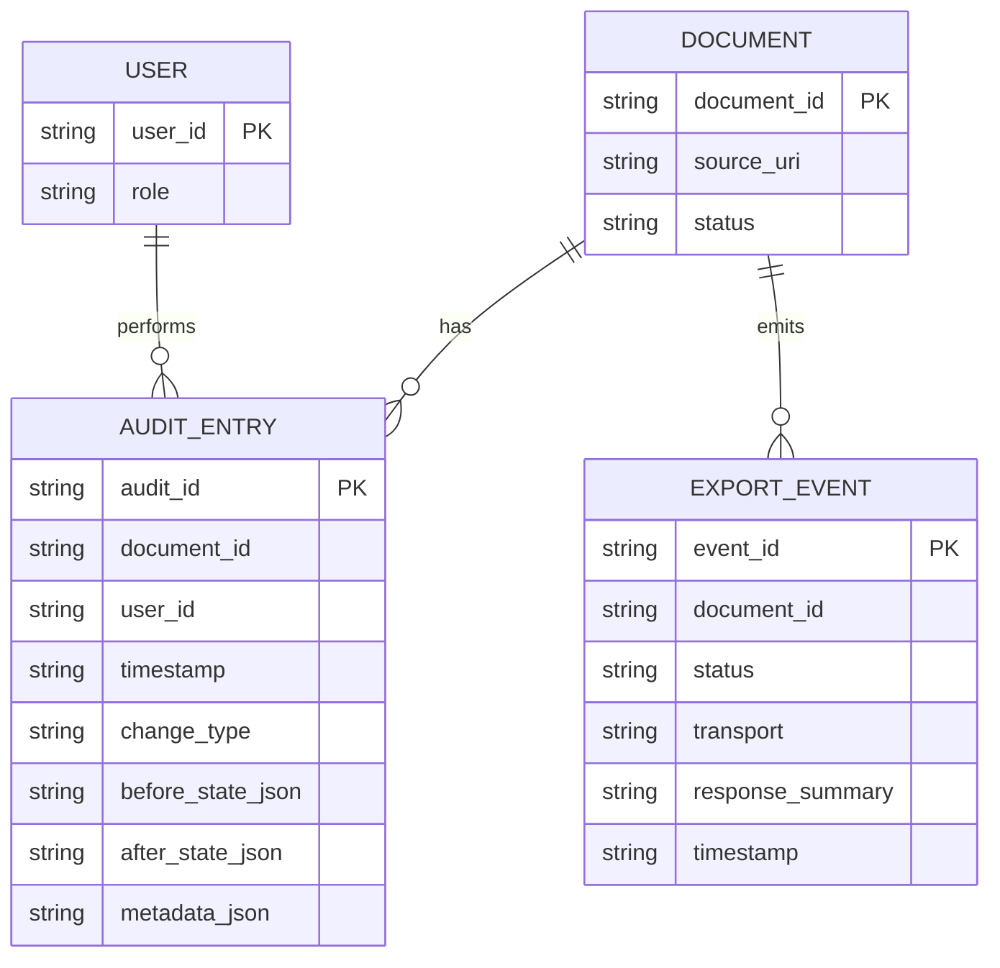

# Database Schema

## DynamoDB tables

### `ClinicalDocumentAuditLog`

Stores all review, decision, and export events.

Primary key:
- `audit_id` (HASH)

GSIs:
- `document-index` (`document_id` HASH + `timestamp` RANGE)
- `user-index` (`user_id` HASH + `timestamp` RANGE)

Core attributes:
- `document_id`
- `user_id`
- `timestamp`
- `change_type`
- `before_state` (JSON string)
- `after_state` (JSON string)
- `metadata` (JSON string)

### `...-audit-log` (Terraform-managed environment tables)

Equivalent environment-specific table naming through IaC.

## ER diagram (logical)

