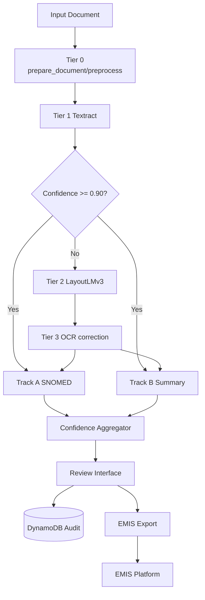
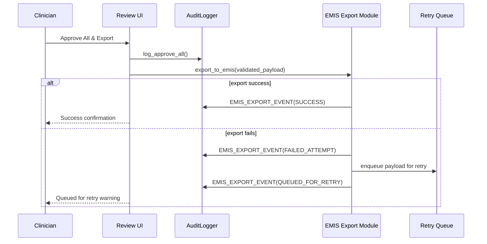

# Data Flow Diagrams

## Pipeline stage data flow

```mermaid
flowchart TD
    U[Input Document] --> T0[Tier 0\nprepare_document/preprocess]
    T0 --> T1[Tier 1 Textract]
    T1 --> R{Confidence >= 0.90?}
    R -->|Yes| A[Track A SNOMED]
    R -->|Yes| B[Track B Summary]
    R -->|No| T2[Tier 2 LayoutLMv3]
    T2 --> T3[Tier 3 OCR correction]
    T3 --> A
    T3 --> B
    A --> C[Confidence Aggregator]
    B --> C
    C --> UI[Review Interface]
    UI --> AD[(DynamoDB Audit)]
    UI --> EX[EMIS Export]
    EX --> EMIS[EMIS Platform]
```

## Review + export decision flow

```mermaid
sequenceDiagram
    participant Clinician
    participant UI as Review UI
    participant Audit as AuditLogger
    participant EMIS as EMIS Export Module
    participant Queue as Retry Queue

    Clinician->>UI: Approve All & Export
    UI->>Audit: log_approve_all()
    UI->>EMIS: export_to_emis(validated_payload)
    alt export success
      EMIS->>Audit: EMIS_EXPORT_EVENT(SUCCESS)
      UI-->>Clinician: Success confirmation
    else export fails
      EMIS->>Audit: EMIS_EXPORT_EVENT(FAILED_ATTEMPT)
      EMIS->>Queue: enqueue payload for retry
      EMIS->>Audit: EMIS_EXPORT_EVENT(QUEUED_FOR_RETRY)
      UI-->>Clinician: Queued for retry warning
    end
```
